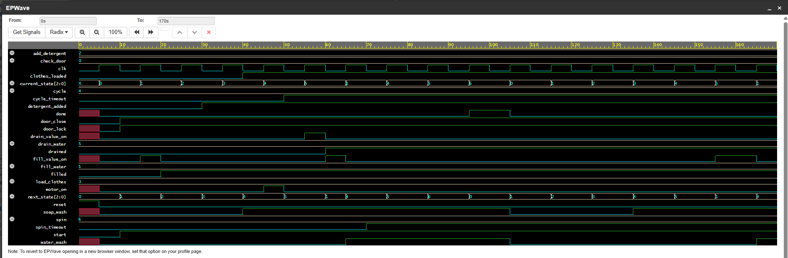

# Automatic Washing Machine Controller (Verilog HDL)

A Finite State Machine (FSM) based controller model for an automatic washing machine, designed and tested using Verilog HDL.

## 🛠️ Tech Stack & Tools
* **Language:** Verilog HDL (SystemVerilog)
* **Tools:** EDA Playground, EPWave

## 📋 Features & State Transitions
The controller manages the sequential operations of an automated washing system through defined states:
* `check_door` $\rightarrow$ Validates safety interlocks.
* `fill_water` & `add_detergent` $\rightarrow$ Prepares the wash cycle.
* `load_clothes` $\rightarrow$ Initiates the main cycle.
* `cycle` / `drain_water` / `spin` $\rightarrow$ Executes wash, rinsing, and water evacuation stages.

## 🚀 How to Run
1. Open [EDA Playground](https://www.edaplayground.com/).
2. Copy the contents of `design.sv` into the **Design** panel.
3. Copy the contents of `testbench.sv` into the **Testbench** panel.
4. Run the simulation to observe state changes and testbench wave transitions.

## ⚙️ FSM States, Inputs & Outputs

The controller operates as a sequential Finite State Machine (FSM) comprising **7 distinct operational states**[cite: 3, 20]:
1. `check_door` (3'b000)[cite: 3]
2. `fill_water` (3'b001)[cite: 3]
3. `add_detergent` (3'b010)[cite: 3]
4. `load_clothes` (3'b011)[cite: 3]
5. `cycle` (3'b100)[cite: 3]
6. `drain_water` (3'b101)[cite: 3]
7. `spin` (3'b110)[cite: 3]

### **Control Signals & Interlocks**
* **Inputs:** Driven via testbench stimulus to simulate real-world triggers (`clk`, `reset`, `door_close`, `start`, `filled`, `drained`, `detergent_added`, `cycle_timeout`, `spin_timeout`)[cite: 3, 28, 29].
* **Outputs:** Actuates system hardware once safety interlocks and conditions are met (`door_lock`, `motor_on`, `fill_value_on`, `drain_value_on`, `soap_wash`, `water_wash`, `done`)[cite: 3, 28, 29].

## 📊 Simulation Waveform

